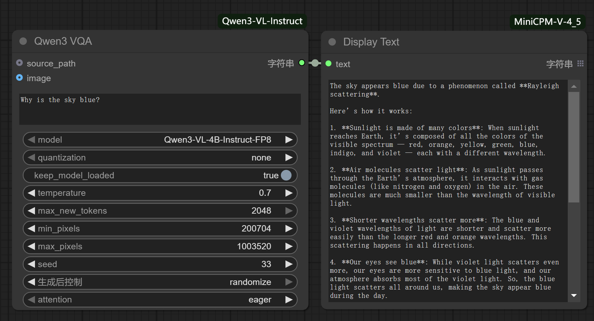
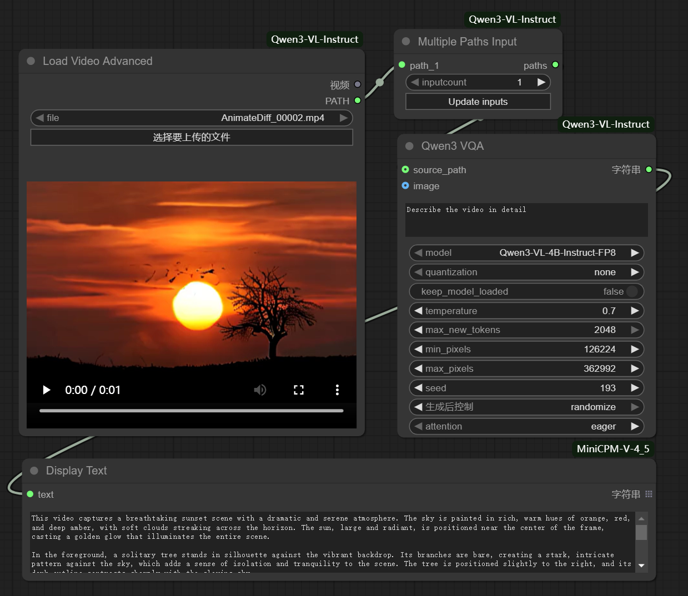
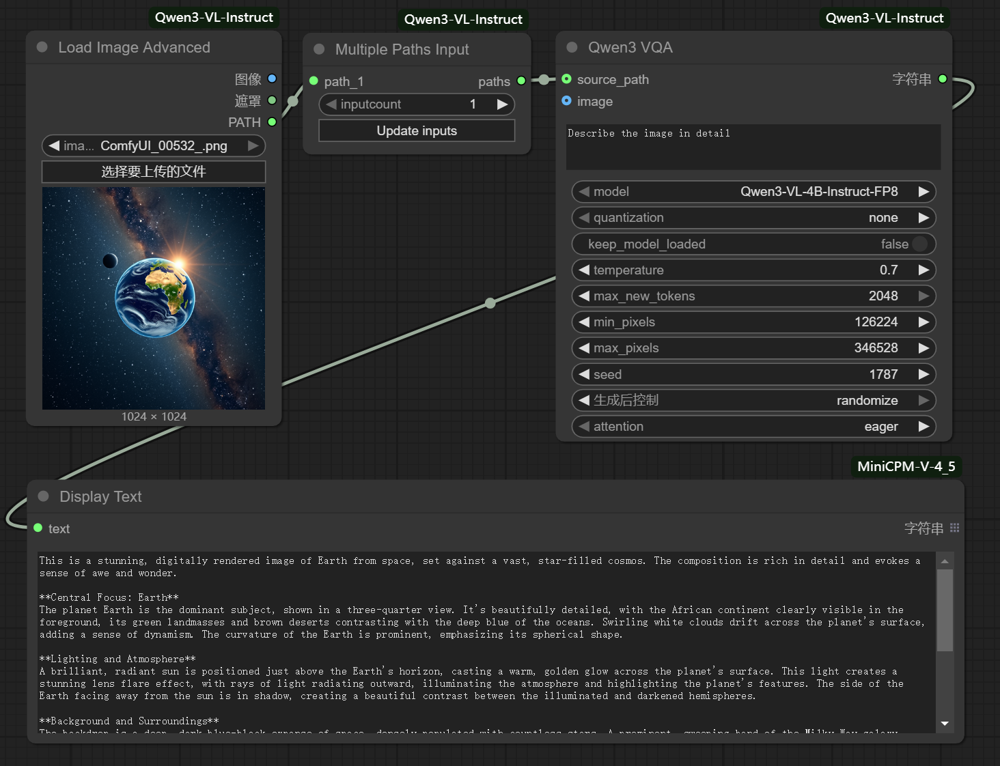
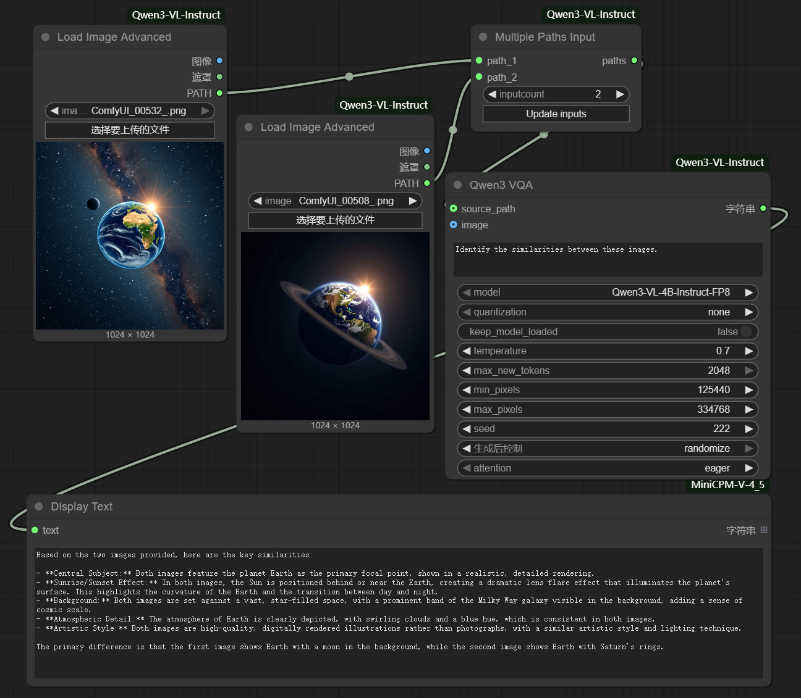

# ComfyUI_Qwen2_5-VL-Instruct

This is an implementation of [Qwen2.5-VL-Instruct](https://github.com/QwenLM/Qwen2.5-VL) by [ComfyUI](https://github.com/comfyanonymous/ComfyUI), which includes, but is not limited to, support for text-based queries, video queries, single-image queries, and multi-image queries to generate captions or responses.

---

## Basic Workflow

- **Text-based Query**: Users can submit textual queries to request information or generate descriptions. For instance, a user might input a description like "What is the meaning of life?"



- **Video Query**: When a user uploads a video, the system can analyze the content and generate a detailed caption for each frame or a summary of the entire video. For example, "Generate a caption for the given video."



- **Single-Image Query**: This workflow supports generating a caption for an individual image. A user could upload a photo and ask, "What does this image show?" resulting in a caption such as "A majestic lion pride relaxing on the savannah."



- **Multi-Image Query**: For multiple images, the system can provide a collective description or a narrative that ties the images together. For example, "Create a story from the following series of images: one of a couple at a beach, another at a wedding ceremony, and the last one at a baby's christening."



> [!IMPORTANT] Important Notes for Using the Workflow
> Please ensure that you have the "Display Text node" available in your ComfyUI setup. If you encounter any issues with this node being missing, you can find it in the [ComfyUI_MiniCPM-V-4 repository](https://github.com/IuvenisSapiens/ComfyUI_MiniCPM-V-4). Installing this additional addon will make the "Display Text node" available for use.

## Installation

- Install from [ComfyUI Manager](https://github.com/ltdrdata/ComfyUI-Manager) (search for `Qwen2`)

- Download or git clone this repository into the `ComfyUI\custom_nodes\` directory and run:

```python
pip install -r requirements.txt
```

## Download Models

All the models will be downloaded automatically when running the workflow if they are not found in the `ComfyUI\models\prompt_generator\` directory.
